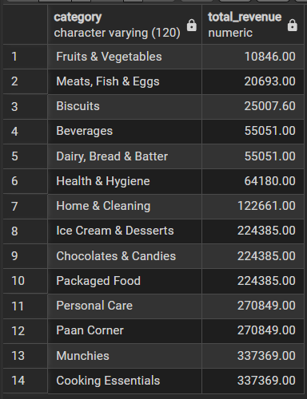
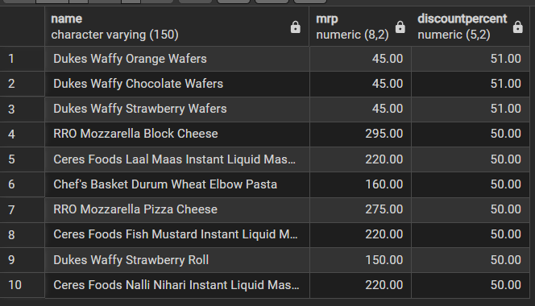
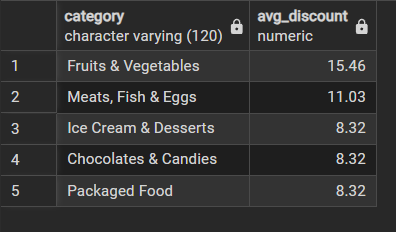
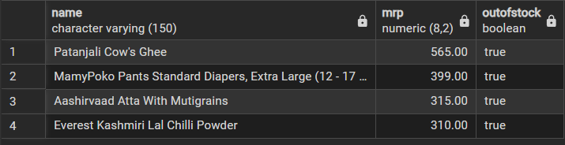

# 🛒 Zepto Business Insights Analysis (SQL Project)

## 🔍 Project Overview

This project focuses on analyzing Zepto’s business data using SQL to extract meaningful insights related to pricing, discounts, inventory, and category performance.

The objective is to simulate real-world business analysis and demonstrate strong SQL querying, data interpretation, and analytical thinking skills.

---

## 🎯 Objectives

* Analyze revenue distribution across product categories
* Identify best-value and high-discount products
* Detect out-of-stock and inventory issues
* Evaluate pricing efficiency and product value
* Generate actionable business insights

---

## 🛠️ Tech Stack

* **SQL** (MySQL / PostgreSQL compatible)
* **Excel / CSV** (Data source)
* **GitHub** (Project hosting)

---

## 📁 Dataset Information

The dataset includes:

* Product details
* Category information
* Pricing (MRP, discount)
* Weight and inventory data
* Stock availability

---

## 📊 Key SQL Analyses Performed

* Revenue estimation by category
* Discount analysis across products and categories
* Inventory and stock availability tracking
* Price efficiency (price per gram)
* Product segmentation based on weight

---

## 📸 Project Screenshots

### 🔹 Revenue by Category



---

### 🔹 Top Discounts Analysis



---

### 🔹 Best Discount Category



---

### 🔹 Out of Stock Analysis



---

## 📊 Business Insights

* Identified **top 10 best-value products** based on highest discount percentages
* Detected **high-MRP products that are currently out of stock**, indicating potential revenue loss
* Estimated **potential revenue across product categories** to identify high-performing segments
* Filtered **premium products (MRP > ₹500) with low discounts**, highlighting pricing inefficiencies
* Ranked **top 5 categories offering highest average discounts**
* Calculated **price per gram** to identify value-for-money products
* Segmented products into **Low, Medium, and Bulk weight categories** for better analysis
* Measured **total inventory weight per category**, helping understand stock distribution

---

## 💡 Business Recommendations

* Improve inventory planning for high-demand, out-of-stock products
* Optimize discount strategies to balance profitability and sales
* Focus on high-performing categories for marketing and promotions
* Re-evaluate pricing for premium products with low discounts
* Promote value-for-money products identified via price-per-gram analysis

---

## 📂 Project Structure

```bash
zepto-sql-analysis/
│── images/
│   ├── revenue_by_category.png
│   ├── top_discounts.png
│   ├── best_discount_category.png
│   ├── out_of_stock.png
│
│── zepto_business_insights.sql
│── zepto_v1.csv
│── zepto_v1.xlsx
│── README.md
```

---

## 🚀 How to Use

1. Import dataset into your SQL environment
2. Run queries from `zepto_business_insights.sql`
3. Analyze outputs and compare with screenshots
4. Derive insights and business conclusions

---

## 🙌 Author

**Nitish Gope**

---

## ⭐ If you found this useful

Give this repo a ⭐ and feel free to connect!
